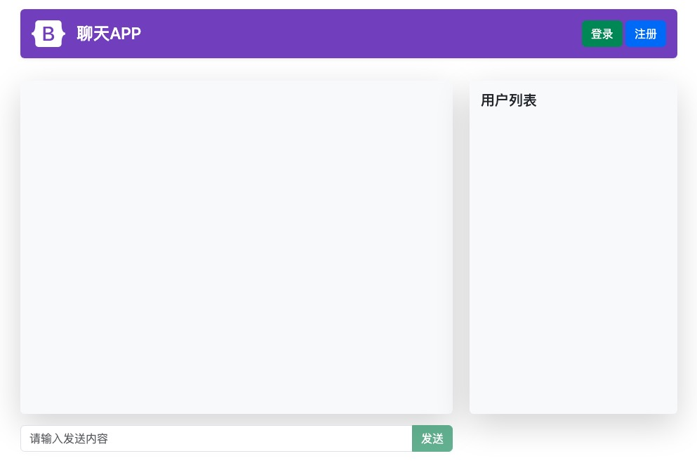
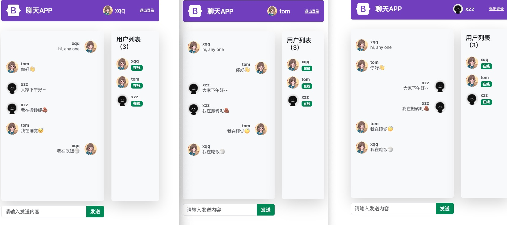

# websocket-chat 

这是一个基于 Go + `net/websocket（标准扩展库）` + redis 的 websocket 聊天小demo。


``运行程序``

在 `db/db.go` 修改成你的Redis环境配置后，执行 `go run cmd/web/*.go` 即可运行。

```go
func NewRedisClient() *redis.Client {
	rdb := redis.NewClient(&redis.Options{
		Addr:     "localhost:6379",
		Password: "",
		DB:       0,
	})

	return rdb
}
```


``功能列表``
- 注册：用户注册，数据保存到Redis 
- 登录：用户通过HTTP请求登录认证，基于Session + Cookie 实现
- 授权中间件：通过认证后允许发送聊天内容，每次 websocket 发送消息都会进行认证授权
- 恐慌中间件
- 自定义websocket简单协议处理任务
- 群聊功能
- 退出登录
- 前端页面使用 Botstrap5 实现
- 使用html/template渲染页面 + JS交互
- 使用reconnecting-websocket.min.js替代H5的WebScoket API，保存连接一直存活

``效果图``

